# CSV Batch Import processing & Anomaly Report
**System Import Identifier:** `#IMP-2026-0614-09`  
**Target Group:** `Shared Apartment Expenses`  
**Import Date:** `2026-06-14T20:12:00Z`  
**Uploader User:** `Aisha (Admin)`  
**Source File:** `apartment_expenses_q1.csv`  

---

## 1. Import Run Summary

| Metric | Count | Status / Notes |
| :--- | :--- | :--- |
| **Total Rows Parsed** | 42 | Full sheet parsed through stream-based `csv-parser` |
| **Initially Valid Rows** | 24 | Rows immediately passing format and referential checks |
| **Anomaly Blocked Rows** | 18 | Flagged by Rules Engine; held in queue for validation |
| **Successful Database Generations**| 40 | Approved/sanitized rows processed into DB transactions |
| **Permanently Rejected Rows** | 2 | Dismissed or deleted due to zero/negative values |
| **Base Currency Normalization** | INR | Converted using daily exchange rates relative to dates |

---

## 2. Anomaly Severity Breakdown

```mermaid
gantt
    title Anomaly Severity Distribution (18 Detected)
    dateFormat  X
    axisFormat %s
    section Critical
    None : active, 0, 0
    section High
    Missing Payer / Unknown User : crit, active, 0, 6
    Split Ratio / Value Mismatch : crit, active, 6, 10
    Ex-Member Inclusion Conflict : crit, active, 10, 11
    section Medium
    Duplicate Expense Scans : active, 11, 14
    Settlement Routing : active, 14, 15
    section Low
    Currency Mismatch Warnings : active, 15, 17
    Floating Point Precision : active, 17, 18
```

* **CRITICAL**: **0** (No critical database failures or system blocks)
* **HIGH**: **11** (Missing payers, unregistered members, ex-member conflicts, splits not summing to totals)
* **MEDIUM**: **4** (Potential duplicate transactions, settlements recorded as expenses)
* **LOW**: **3** (Currency mismatches, float precision formatting warnings)

---

## 3. Detailed Row-by-Row Anomaly Log & Resolution Actions

The following table details every anomaly identified by the Rules Engine, its origin data, and the specific correction applied to generate the final database ledger.

| Row | Date | Description | Payer | Amount | Anomaly Code | Severity | Description of Problem | Resolution / Action Taken | Audit Link |
| :---: | :--- | :--- | :--- | :--- | :--- | :---: | :--- | :--- | :--- |
| **4** | 2026-02-15 | Dinner at N | Dev | 3,200.00 INR | `UNKNOWN_MEMBER` | **HIGH** | Payer `Dev` is not a registered user in the database. | Dev was registered in the application and added as a member of the group. | `EXP-004` |
| **5** | 2026-02-15 | dinner - ma | Dev | 3,200.00 INR | `DUPLICATE_EXPENSE` | **MEDIUM** | Duplicate of Row 4 (same date, payer, amount, and split group). | User approved override with note: "Two separate dinners paid by Dev on the same day". | `EXP-005` |
| **6** | 2026-02-18 | Electricity F | Aisha | 1,200 INR | `INVALID_AMOUNT` | **HIGH** | Text contains a comma (`1,200`), causing parsing failures. | String sanitized to numeric `1200.00`. Converted from INR to USD base currency. | `EXP-006` |
| **9** | 2026-02-28 | Cylinder re | Rohan | 899.995 INR | `PRECISION_ANOMALY` | **LOW** | Amount has 3 decimal places (`899.995`). | Auto-rounded using half-up arithmetic to `900.00 INR`. | `EXP-009` |
| **10** | 2026-03-02 | Groceries D | Priya S | 1,875.00 INR | `UNKNOWN_MEMBER` | **HIGH** | `Priya S` is not found in database. | Mapped to registered user `Priya` (spelling correction in UI). | `EXP-010` |
| **11** | 2026-03-05 | Aisha birth | Rohan | 1,500.00 INR | `UNEQUAL_SPLIT_MISMATCH` | **HIGH** | Split details (`Rohan 700`) do not sum to total amount `1500`. | Split detail corrected to `Rohan 700; Priya 800` to balance total cost. | `EXP-011` |
| **12** | 2026-03-10 | House cleaning | (Blank) | 780.00 INR | `MISSING_PAYER` | **HIGH** | Payer field is blank/empty in CSV structure. | Payer manually resolved to `Aisha` after checking physical receipt. | `EXP-012` |
| **13** | 2026-03-12 | Rohan paid | Rohan | 5,000.00 INR | `SETTLEMENT_AS_EXPENSE` | **MEDIUM** | Description and split structure indicate repayment settlement. | Rerouted from Expense creation to generate a `Settlement` record in database. | `SET-001` |
| **14** | 2026-03-15 | Pizza Friday | Aisha | 1,440.00 INR | `INVALID_PERCENTAGE_SPLIT` | **HIGH** | Split percentages (`Aisha 30%`) do not sum to exactly 100%. | Split updated to equal shares among participants (`Aisha 30%; Rohan 30%; Priya 20%; Meera 20%`). | `EXP-014` |
| **21** | 2026-03-24 | Scooter rer | Priya | 3,600.00 INR | `UNEQUAL_SPLIT_MISMATCH` | **HIGH** | Split details (`Aisha 1; Ro...`) are cut off and invalid. | Restored split detail to `Aisha 1800; Rohan 1800` (equal shares between them). | `EXP-021` |
| **25** | 2026-03-28 | Parasailing | Dev | -30.00 USD | `NEGATIVE_AMOUNT` | **HIGH** | Negative amount (`-30.00`) is invalid for outlays. | **REJECTED**: Blocked. Logged separately as a positive $30.00 refund settlement. | *None* |
| **27** | 2026-04-02 | Groceries D | Priya | 2,105.00 | `CURRENCY_MISMATCH` | **LOW** | Currency is missing (blank). Assumed default base. | Warned user; verified amount format is in INR and set database currency code. | `EXP-027` |
| **30** | 2026-04-08 | Dinner orde | Priya | 0.00 INR | `INVALID_AMOUNT` | **HIGH** | Amount is `0.00`. | **REJECTED**: Dismissed as duplicate entry (marked "counted twice" in CSV notes). | *None* |
| **31** | 2026-04-12 | Weekend b | Meera | 2,200.00 INR | `INVALID_PERCENTAGE_SPLIT` | **HIGH** | Split percentages (`Aisha 30%; Rohan 30%`) do not sum to 100%. | Corrected to equal splits among active members (`Aisha 50%; Rohan 50%`). | `EXP-031` |
| **35** | 2026-04-20 | Groceries B | Priya | 2,640.00 INR | `EX_MEMBER_EXPENSE` | **HIGH** | Split includes `Meera` who had already left group on 2026-04-15. | Removed `Meera` from splits; split amount redistributed among active members. | `EXP-035` |
| **37** | 2026-04-22 | Sam deposi | Sam | 15,000.00 INR | `UNKNOWN_MEMBER` | **HIGH** | `Sam` is not registered in the database or group. | Registered `Sam` in system, set group joining date, and approved transaction. | `EXP-037` |
| **41** | 2026-04-28 | Furniture f | Aisha | 12,000.00 INR | `UNEQUAL_SPLIT_MISMATCH` | **HIGH** | Split type is `equal` but split detail contains share metrics. | Cleaned up split type; validated that it distributes equally among all 4 members. | `EXP-041` |

---

## 4. Ledger Generation Actions Summary

Upon resolving the anomalies in the approval queue, the import processor executed the database ledger generation inside a single, atomic Prisma transaction:

1. **Expenses Generated**: 38 database records were successfully inserted into the `expenses` and `expense_splits` tables.
2. **Settlements Generated**: 2 database records were successfully inserted into the `settlements` table (Row 13, and the Row 25 refund settlement).
3. **Currency Conversion Engine**: Computed exchange rate ratios for all USD transactions (e.g. villa booking at `1 USD = 83.50 INR` on Row 19, parasailing on Row 22, and beach shack on Row 20) and logged both the original currency outlays and the `normalizedAmount` in **INR**.
4. **Audit Trail Preservation**: Each generated expense and settlement record stores a foreign key to `importId` (`#IMP-2026-0614-09`) and the specific `importRowId` to guarantee complete backward-traceability.
