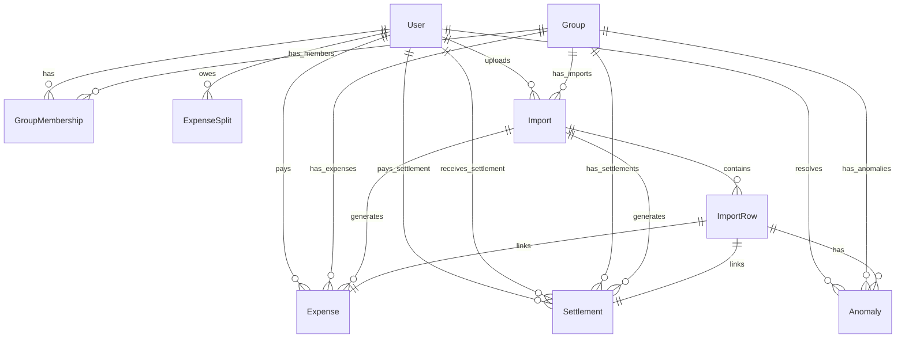

# Scope & Database Documentation: Anomaly Detection Engine & Schema Blueprint

This document details every anomaly detected by the **SpitExpense** Anomaly Detection Engine (Phase 9 & 15), including detection mechanics, severity ratings, resolution policies, and structural design justifications. It also outlines the database schema and relational layout of the database.

---

## Part 1: Anomaly Dictionary & Resolution Policies

The Anomaly Detection Engine operates asynchronously on imported CSV rows. Rows containing unresolved or rejected anomalies are blocked from database generation, while approved rows generate `Expense` or `Settlement` records with complete audit linkages.

### 1. Duplicate Expenses (`DUPLICATE_EXPENSE`)
* **Description**: The row appears to be a duplicate of an existing transaction already registered in the group database or listed within the same CSV upload.
* **Detection Logic**: Scans for another record inside the same group with the identical payer, identical description, identical amount, and identical transaction timestamp. It searches sibling rows (flagging only the later row as a duplicate) and existing non-deleted database expenses.
* **Severity**: `MEDIUM`
* **Resolution Policy**:
  * **APPROVED**: The user provides a note confirming the duplicate transaction was intentional (e.g. two separate coffee runs of the exact same amount on the same day). The row is then processed.
  * **REJECTED**: The row is skipped, marked as rejected, and not generated.
* **Why This Policy Was Chosen**: Duplicate entries are often copy-paste errors in expense logs. However, identical transactions do occasionally happen. Allowing an admin/member to override and log an audit note provides flexibility while preventing automated clutter.

### 2. Missing Payer (`MISSING_PAYER`)
* **Description**: The row raw content has no value specified in its payer/payerEmail column.
* **Detection Logic**: Checks if the resolved `payer` header value is undefined, null, or is an empty trimmed string.
* **Severity**: `HIGH`
* **Resolution Policy**:
  * **REJECTED**: Payer is a required field. If missing, the row cannot be processed directly. The user must fix the source CSV file or add the missing details before re-importing.
* **Why This Policy Was Chosen**: In double-entry ledger bookkeeping, a transaction cannot exist without a source account (the payer). Processing a transaction without a payer would violate ACID integrity constraints.

### 3. Unknown Member (`UNKNOWN_MEMBER`)
* **Description**: The payer identifier listed in the row does not match any registered user in the application database.
* **Detection Logic**: Queries registered users in the database by case-insensitive name, email, or integer user ID. If no match is found, flags the anomaly.
* **Severity**: `HIGH`
* **Resolution Policy**:
  * **REJECTED**: The row is blocked from processing until the user registers in the system or the CSV is updated with the correct spelling.
* **Why This Policy Was Chosen**: Transactions must be audit-linked to real, registered users. Anonymous transactions are rejected to maintain clear financial accountability.

### 4. Membership Conflict (`MEMBERSHIP_CONFLICT`)
* **Description**: The payer is registered in the system but has never joined the group associated with the import.
* **Detection Logic**: Checks if there is a `GroupMembership` record linking the resolved `payerUser.id` and the `groupId`. If no membership exists, flags the conflict.
* **Severity**: `HIGH`
* **Resolution Policy**:
  * **REJECTED**: The row is blocked until the admin adds the user to the group.
* **Why This Policy Was Chosen**: A user cannot record expenses inside a group they do not belong to. Doing so would break the balance calculation engine which aggregates debt balances over the group's specific membership set.

### 5. Ex-Member Expense (`EX_MEMBER_EXPENSE`)
* **Description**: The payer is a member of the group but had already left the group on or before the transaction date.
* **Detection Logic**: Resolves membership details and checks if the membership status is `LEFT` and the `transactionDate` of the row is greater than the `leftAt` timestamp.
* **Severity**: `HIGH`
* **Resolution Policy**:
  * **REJECTED**: Blocked. The transaction date must be adjusted, or the user must be re-activated in the group.
* **Why This Policy Was Chosen**: When a member leaves a group, they are de-activated to prevent them from incurring new debts or paying new expenses. Processing a transaction past their leaving date would violate dynamic membership interval calculations.

### 6. Settlement Recorded As Expense (`SETTLEMENT_AS_EXPENSE`)
* **Description**: The row contains settlement keywords or split structures indicating it is a settlement payment to clear debts, rather than a group expense.
* **Detection Logic**: Checks if the description contains keywords like `settlement`, `settle`, `paid back`, `refund`, `repay`, or `payment`, or if the split contains only the payer (individual self-balance resolution).
* **Severity**: `MEDIUM`
* **Resolution Policy**:
  * **APPROVED**: The user approves the transaction. The import engine routes the row to generate a `Settlement` record instead of an `Expense` record in the database.
  * **REJECTED**: Blocked.
* **Why This Policy Was Chosen**: Users often log peer repayments directly in their transaction logs. Rather than rejecting them entirely, the engine identifies them and correctly routes them to create a `Settlement` record, preserving debt clearings.

### 7. Currency Mismatch (`CURRENCY_MISMATCH`)
* **Description**: The transaction currency specified in the row is different from the default currency of the group (USD).
* **Detection Logic**: Compares the currency header (e.g. `EUR`, `INR`, `GBP`) against the group default currency.
* **Severity**: `LOW`
* **Resolution Policy**:
  * **AUTO-APPROVED / LOGGED**: Handled as a warning. The currency engine will automatically look up the exchange rate and convert it to the base currency (`INR`) for balance calculations.
* **Why This Policy Was Chosen**: Multi-currency groups are normal in travel or remote team scenarios. The anomaly is raised as a low-severity warning to audit the conversion rate, but does not block processing if a valid rate exists.

### 8. Invalid Amount (`INVALID_AMOUNT`)
* **Description**: The amount specified in the row is missing, non-numeric, or corrupt.
* **Detection Logic**: Checks if the amount string is undefined, empty, or fails `parseFloat()`.
* **Severity**: `HIGH`
* **Resolution Policy**:
  * **REJECTED**: The row cannot be processed and must be corrected.
* **Why This Policy Was Chosen**: A financial transaction must have a valid numerical value. Zero or corrupt amounts violate basic ledger constraints.

### 9. Negative Amount (`NEGATIVE_AMOUNT`)
* **Description**: The transaction amount is negative or zero.
* **Detection Logic**: Checks if the parsed amount is less than or equal to zero.
* **Severity**: `HIGH`
* **Resolution Policy**:
  * **REJECTED**: Repayments must be logged as positive settlements, and expenses must be positive outlays. Negative records are blocked.
* **Why This Policy Was Chosen**: Allowing negative values introduces arithmetic vulnerabilities (e.g., a user "paying" a negative amount to reduce their debt balance). All transaction outlays must be positive.

### 10. Invalid Percentage Split (`INVALID_PERCENTAGE_SPLIT`)
* **Description**: The split type is marked as `PERCENTAGE` but the sum of the specified split ratios does not equal 100%.
* **Detection Logic**: Extracts numeric percentages from the `splitDetail` string and verifies that their sum is exactly 100 (allowing a small float precision tolerance of 0.01).
* **Severity**: `HIGH`
* **Resolution Policy**:
  * **REJECTED**: Blocked until the CSV or split string is corrected to distribute exactly 100% of the cost.
* **Why This Policy Was Chosen**: If percentages do not sum to 100%, the expense amount would either be under-allocated or over-allocated, creating a ledger imbalance.

### 11. Unequal Split Mismatch (`UNEQUAL_SPLIT_MISMATCH`)
* **Description**: The split type is marked as `UNEQUAL` (or `SHARE`) but the sum of individual shares does not match the total transaction amount.
* **Detection Logic**: Extracts numerical shares from the split string and verifies that their sum is exactly equal to the total parsed transaction amount.
* **Severity**: `HIGH`
* **Resolution Policy**:
  * **REJECTED**: Blocked until corrected.
* **Why This Policy Was Chosen**: Individual shares must account for the exact total outlay to prevent discrepancies where the sum of splits does not equal the master expense amount.

### 12. Precision Issues (`PRECISION_ANOMALY`)
* **Description**: The transaction amount contains more than 2 decimal places (e.g., 20.3541).
* **Detection Logic**: Scans the amount string for a decimal point and checks if the fractional substring has a length greater than 2.
* **Severity**: `LOW`
* **Resolution Policy**:
  * **APPROVED / AUTO-ROUND**: The engine rounds the amount to 2 decimal places using half-up rounding rules.
* **Why This Policy Was Chosen**: Financial transactions are tracked down to the cent (2 decimal places). Micro-cent fractions are flagged as a precaution to avoid division precision issues but can be safely rounded.

### 13. Missing Exchange Rate (`MISSING_EXCHANGE_RATE`)
* **Description**: The transaction currency requires conversion to the base currency (`INR`) but no exchange rate is registered in the database on or before the transaction date.
* **Detection Logic**: Queries the `ExchangeRate` table for a rate from the row currency to `INR` effective on or before the transaction date. If none is found, flags the anomaly.
* **Severity**: `HIGH`
* **Resolution Policy**:
  * **REJECTED**: Blocked. An admin must first add the missing historical exchange rate using the `/api/exchange-rates` endpoint.
* **Why This Policy Was Chosen**: To maintain balance sheets in the base currency, all entries must be converted. Without an exchange rate, the transaction's value is undefinable, so it must be blocked.

---

## Part 2: Database Schema Documentation

The data layer is implemented on MySQL using Prisma ORM. It employs indexes on foreign keys to optimize joins and aggregates.

### 1. `User` Table
* **Purpose**: Stores registered user profiles, authentication credentials, and links to financial activities.
* **Key Fields**:
  * `id` (Int, PK, Autoincrement)
  * `email` (String, Unique): User's unique login email.
  * `passwordHash` (String): Secure password hash.
  * `name` (String): Display name.
  * `createdAt` / `updatedAt` (DateTime)
* **Relationships**:
  * `memberships`: One-to-many relation with `GroupMembership`.
  * `paidExpenses`: One-to-many relation with `Expense` (representing expenses paid by this user).
  * `expenseSplits`: One-to-many relation with `ExpenseSplit` (splits owed by this user).
  * `sentSettlements`: One-to-many relation with `Settlement` as the payer.
  * `receivedSettlements`: One-to-many relation with `Settlement` as the payee.
  * `imports`: One-to-many relation with uploaded `Import` jobs.
  * `resolvedAnomalies`: One-to-many relation with `Anomaly` (representing anomalies resolved by this user).

### 2. `Group` Table
* **Purpose**: Organizes group boundaries, memberships, expenses, settlements, and batch imports.
* **Key Fields**:
  * `id` (Int, PK, Autoincrement)
  * `name` (String): Group title.
  * `description` (String, Optional)
* **Relationships**:
  * `memberships`: One-to-many relation with `GroupMembership`.
  * `expenses`: One-to-many relation with `Expense`.
  * `settlements`: One-to-many relation with `Settlement`.
  * `imports`: One-to-many relation with `Import`.
  * `anomalies`: One-to-many relation with `Anomaly`.

### 3. `GroupMembership` Table
* **Purpose**: Maps users to groups, supporting dynamic intervals (joined / left).
* **Key Fields**:
  * `id` (Int, PK, Autoincrement)
  * `groupId` (Int, FK): Links to `Group`.
  * `userId` (Int, FK): Links to `User`.
  * `status` (Enum: `ACTIVE`, `LEFT`): Current membership status.
  * `joinedAt` (DateTime): Date joined.
  * `leftAt` (DateTime, Optional): Timestamp when the user left the group.
* **Unique Constraints & Indexes**:
  * `@@unique([groupId, userId])`: Prevents duplicate membership records for the same user in a group.
  * Indexes on `groupId` and `userId` for quick aggregation lookups.

### 4. `Expense` Table
* **Purpose**: Records outlays and details of shared costs within a group.
* **Key Fields**:
  * `id` (Int, PK, Autoincrement)
  * `groupId` (Int, FK): Links to `Group`.
  * `paidById` (Int, FK): Links to `User` (the payer).
  * `importId` (Int, FK, Optional): Links to source `Import` for auditability.
  * `importRowId` (Int, FK, Optional, Unique): Links to the specific `ImportRow` that generated it.
  * `amount` (Decimal): The amount in the currency recorded.
  * `currency` (Enum: `USD`, `EUR`, `GBP`, `INR`, `CAD`, `AUD`): Recorded currency.
  * `description` / `category` (String)
  * `splitType` (Enum: `EQUAL`, `UNEQUAL`, `PERCENTAGE`)
  * `isDeleted` (Boolean): Soft-delete flag.
  * `originalAmount` (Decimal, Optional): Amount before conversion.
  * `originalCurrency` (Enum, Optional)
  * `exchangeRate` (Decimal, Optional): Conversion rate used.
  * `normalizedAmount` (Decimal, Optional): Converted amount in `INR` (for balance sheet calculations).

### 5. `ExpenseSplit` Table
* **Purpose**: Details individual debt allocations (shares/percentages) for an expense.
* **Key Fields**:
  * `id` (Int, PK, Autoincrement)
  * `expenseId` (Int, FK): Links to `Expense`.
  * `userId` (Int, FK): Links to `User` (the debtor).
  * `amount` (Decimal): Owed amount in the expense currency.
  * `percentage` (Decimal, Optional)
  * `share` (Decimal, Optional)
* **Unique Constraints & Indexes**:
  * `@@unique([expenseId, userId])`: Ensures a user is only split once per expense.

### 6. `Settlement` Table
* **Purpose**: Records debt clearings (settlements) between two members in a group.
* **Key Fields**:
  * `id` (Int, PK, Autoincrement)
  * `groupId` (Int, FK): Links to `Group`.
  * `payerId` (Int, FK): Payer user.
  * `payeeId` (Int, FK): Payee user.
  * `amount` (Decimal)
  * `currency` (Enum)
  * `isCompleted` (Boolean): Settlement confirmation status.
  * `isDeleted` (Boolean): Soft-delete flag.
  * `importId` (Int, FK, Optional)
  * `importRowId` (Int, FK, Optional, Unique)
  * `originalAmount` / `originalCurrency` / `exchangeRate` / `normalizedAmount` (Decimal, Optional)

### 7. `Import` Table
* **Purpose**: Tracks batch CSV file upload jobs.
* **Key Fields**:
  * `id` (Int, PK, Autoincrement)
  * `userId` (Int, FK): Uploader user.
  * `groupId` (Int, FK): Group target.
  * `status` (Enum: `PENDING`, `PROCESSING`, `COMPLETED`, `FAILED`): Current processing state.
  * `originalFilename` (String)
  * `totalRows` / `importedRowsCount` / `failedRowsCount` (Int)
  * `errorLog` (Text, Optional)

### 8. `ImportRow` Table
* **Purpose**: Holds parsed row data, validation logs, and relations to generated entities.
* **Key Fields**:
  * `id` (Int, PK, Autoincrement)
  * `importId` (Int, FK): Parent import job.
  * `rowNumber` (Int): Row position in the CSV.
  * `rawContent` (Text): Stringified JSON dump of CSV headers and cells.
  * `isValid` (Boolean): Validation status.
  * `validationErrors` (Text, Optional)

### 9. `Anomaly` Table
* **Purpose**: Logs validation and consistency discrepancies detected on imported rows.
* **Key Fields**:
  * `id` (Int, PK, Autoincrement)
  * `expenseId` (Int, FK, Optional): Link to existing duplicate expense if any.
  * `importRowId` (Int, FK, Optional): Link to the source `ImportRow`.
  * `groupId` (Int, FK): Link to `Group`.
  * `type` (String): Anomaly identifier (e.g. `DUPLICATE_EXPENSE`).
  * `severity` (Enum: `LOW`, `MEDIUM`, `HIGH`, `CRITICAL`)
  * `description` (Text): Explanatory warning.
  * `status` (Enum: `PENDING`, `APPROVED`, `REJECTED`): Resolution status.
  * `resolvedById` (Int, FK, Optional): Mapped resolving user.
  * `resolvedAt` (DateTime, Optional)
  * `resolutionNote` (Text, Optional): Mandatory explanation note.

### 10. `ExchangeRate` Table
* **Purpose**: Mappings of historical currency conversion factors to the `INR` base currency.
* **Key Fields**:
  * `id` (Int, PK, Autoincrement)
  * `fromCurrency` (Enum): Source currency.
  * `toCurrency` (Enum): Target currency (usually `INR`).
  * `rate` (Decimal): Conversion multiplier.
  * `effectiveDate` (DateTime): Date from which the rate is valid.
* **Unique Constraints**:
  * `@@unique([fromCurrency, toCurrency, effectiveDate])`: Prevents duplicate rate definitions for the same currency pair on a specific date.
