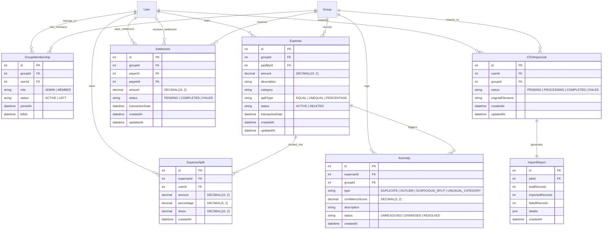

# SpitExpense: Shared Expense Application - Backend Architecture

This document outlines the backend architecture for the **SpitExpense** Shared Expense Application. It serves as the master blueprint for the development of the backend services, database schema, and core algorithms.

---

## 1. Complete Entity-Relationship (ER) Diagram

The system's data layer is designed around relational integrity, ensuring auditability of financial transactions while supporting dynamic group memberships, asynchronous CSV imports, and anomaly logging.



---

## 2. Database Schema Proposal (Prisma Schema)

The database schema is structured for MySQL and implemented via Prisma ORM. Financial figures are stored using the `Decimal` type to avoid floating-point inaccuracies.

```prisma
datasource db {
  provider = "mysql"
  url      = env("DATABASE_URL")
}

generator client {
  provider = "prisma-client-js"
}

enum Role {
  ADMIN
  MEMBER
}

enum MembershipStatus {
  ACTIVE
  LEFT
}

enum SplitType {
  EQUAL
  UNEQUAL
  PERCENTAGE
}

enum ExpenseStatus {
  ACTIVE
  DELETED
}

enum SettlementStatus {
  PENDING
  COMPLETED
  FAILED
}

enum ImportStatus {
  PENDING
  PROCESSING
  COMPLETED
  FAILED
}

enum AnomalyType {
  DUPLICATE
  OUTLIER
  SUSPICIOUS_SPLIT
  UNUSUAL_CATEGORY
}

enum AnomalyStatus {
  UNRESOLVED
  DISMISSED
  RESOLVED
}

model User {
  id                    Int               @id @default(autoincrement())
  email                 String            @unique
  passwordHash          String            @map("password_hash")
  name                  String
  avatarUrl             String?           @map("avatar_url")
  createdAt             DateTime          @default(now()) @map("created_at")
  updatedAt             DateTime          @updatedAt @map("updated_at")
  memberships           GroupMembership[]
  paidExpenses          Expense[]         @relation("PaidExpenses")
  expenseSplits         ExpenseSplit[]
  sentSettlements       Settlement[]      @relation("SentSettlements")
  receivedSettlements   Settlement[]      @relation("ReceivedSettlements")
  importJobs            CSVImportJob[]

  @@map("users")
}

model Group {
  id          Int               @id @default(autoincrement())
  name        String
  description String?
  createdAt   DateTime          @default(now()) @map("created_at")
  updatedAt   DateTime          @updatedAt @map("updated_at")
  memberships GroupMembership[]
  expenses    Expense[]
  settlements Settlement[]
  anomalies   Anomaly[]
  importJobs  CSVImportJob[]

  @@map("groups")
}

model GroupMembership {
  id        Int              @id @default(autoincrement())
  groupId   Int              @map("group_id")
  userId    Int              @map("user_id")
  role      Role             @default(MEMBER)
  status    MembershipStatus @default(ACTIVE)
  joinedAt  DateTime         @default(now()) @map("joined_at")
  leftAt    DateTime?        @map("left_at")
  group     Group            @relation(fields: [groupId], references: [id], onDelete: Cascade)
  user      User             @relation(fields: [userId], references: [id], onDelete: Cascade)

  @@unique([groupId, userId])
  @@index([groupId])
  @@index([userId])
  @@map("group_memberships")
}

model Expense {
  id              Int            @id @default(autoincrement())
  groupId         Int            @map("group_id")
  paidById        Int            @map("paid_by_id")
  amount          Decimal        @db.Decimal(10, 2)
  description     String
  category        String
  splitType       SplitType      @map("split_type")
  status          ExpenseStatus  @default(ACTIVE)
  transactionDate DateTime       @default(now()) @map("transaction_date")
  createdAt       DateTime       @default(now()) @map("created_at")
  updatedAt       DateTime       @updatedAt @map("updated_at")
  group           Group          @relation(fields: [groupId], references: [id], onDelete: Cascade)
  paidBy          User           @relation("PaidExpenses", fields: [paidById], references: [id])
  splits          ExpenseSplit[]
  anomalies       Anomaly[]

  @@index([groupId])
  @@index([paidById])
  @@map("expenses")
}

model ExpenseSplit {
  id         Int      @id @default(autoincrement())
  expenseId  Int      @map("expense_id")
  userId     Int      @map("user_id")
  amount     Decimal  @db.Decimal(10, 2)
  percentage Decimal? @db.Decimal(5, 2)
  share      Decimal? @db.Decimal(10, 2)
  createdAt  DateTime @default(now()) @map("created_at")
  expense    Expense  @relation(fields: [expenseId], references: [id], onDelete: Cascade)
  user       User     @relation(fields: [userId], references: [id], onDelete: Cascade)

  @@unique([expenseId, userId])
  @@index([expenseId])
  @@index([userId])
  @@map("expense_splits")
}

model Settlement {
  id              Int              @id @default(autoincrement())
  groupId         Int              @map("group_id")
  payerId         Int              @map("payer_id")
  payeeId         Int              @map("payee_id")
  amount          Decimal          @db.Decimal(10, 2)
  status          SettlementStatus @default(PENDING)
  transactionDate DateTime         @default(now()) @map("transaction_date")
  createdAt       DateTime         @default(now()) @map("created_at")
  updatedAt       DateTime         @updatedAt @map("updated_at")
  group           Group            @relation(fields: [groupId], references: [id], onDelete: Cascade)
  payer           User             @relation("SentSettlements", fields: [payerId], references: [id])
  payee           User             @relation("ReceivedSettlements", fields: [payeeId], references: [id])

  @@index([groupId])
  @@index([payerId])
  @@index([payeeId])
  @@map("settlements")
}

model CSVImportJob {
  id               Int           @id @default(autoincrement())
  userId           Int           @map("user_id")
  groupId          Int           @map("group_id")
  status           ImportStatus  @default(PENDING)
  originalFilename String        @map("original_filename")
  createdAt        DateTime      @default(now()) @map("created_at")
  updatedAt        DateTime      @updatedAt @map("updated_at")
  user             User          @relation(fields: [userId], references: [id], onDelete: Cascade)
  group            Group         @relation(fields: [groupId], references: [id], onDelete: Cascade)
  report           ImportReport?

  @@index([userId])
  @@index([groupId])
  @@map("csv_import_jobs")
}

model ImportReport {
  id              Int          @id @default(autoincrement())
  jobId           Int          @unique @map("job_id")
  totalRecords    Int          @map("total_records")
  importedRecords Int          @map("imported_records")
  failedRecords   Int          @map("failed_records")
  details         Json         // Detailed log containing row validation errors
  createdAt       DateTime     @default(now()) @map("created_at")
  job             CSVImportJob @relation(fields: [jobId], references: [id], onDelete: Cascade)

  @@map("import_reports")
}

model Anomaly {
  id              Int           @id @default(autoincrement())
  expenseId       Int           @map("expense_id")
  groupId         Int           @map("group_id")
  type            AnomalyType
  confidenceScore Decimal       @map("confidence_score") @db.Decimal(3, 2)
  description     String
  status          AnomalyStatus @default(UNRESOLVED)
  createdAt       DateTime      @default(now()) @map("created_at")
  expense         Expense       @relation(fields: [expenseId], references: [id], onDelete: Cascade)
  group           Group         @relation(fields: [groupId], references: [id], onDelete: Cascade)

  @@index([expenseId])
  @@index([groupId])
  @@map("anomalies")
}
```

---

## 3. API Specification (REST Interface)

All requests requiring authentication must include the HTTP header: `Authorization: Bearer <JWT_TOKEN>`.

### 3.1 Authentication
* **POST `/api/v1/auth/register`**
  * Description: Create a new user account.
  * Request Body: `{ "email": "user@example.com", "password": "SecurePassword123", "name": "John Doe" }`
  * Response (201): `{ "success": true, "user": { "id": 1, "email": "user@example.com", "name": "John Doe" } }`
* **POST `/api/v1/auth/login`**
  * Description: Authenticate and retrieve tokens.
  * Request Body: `{ "email": "user@example.com", "password": "SecurePassword123" }`
  * Response (200): `{ "success": true, "accessToken": "...", "refreshToken": "..." }`
* **POST `/api/v1/auth/refresh`**
  * Description: Refresh access token.
  * Request Body: `{ "refreshToken": "..." }`
  * Response (200): `{ "success": true, "accessToken": "..." }`

### 3.2 Groups & Dynamic Memberships
* **POST `/api/v1/groups`**
  * Description: Create a new group (creator is assigned `Role.ADMIN`).
  * Request Body: `{ "name": "Road Trip 2026", "description": "Summer getaway splits" }`
  * Response (201): `{ "success": true, "group": { "id": 10, "name": "Road Trip 2026" } }`
* **GET `/api/v1/groups`**
  * Description: Retrieve all groups user is member of.
  * Response (200): `{ "success": true, "groups": [...] }`
* **POST `/api/v1/groups/:groupId/members`**
  * Description: Add a user to a group (Dynamic membership: can only add if not already active).
  * Request Body: `{ "userId": 5, "role": "MEMBER" }`
  * Response (200): `{ "success": true, "message": "User added/re-activated in group." }`
* **DELETE `/api/v1/groups/:groupId/members/:userId`**
  * Description: Mark a member as `LEFT` (Dynamic membership: retains expense history but prevents additions to new expenses).
  * Response (200): `{ "success": true, "message": "User successfully removed from active membership." }`

### 3.3 Expenses (Equal, Unequal, Percentage Splits)
* **POST `/api/v1/groups/:groupId/expenses`**
  * Description: Create an expense. Triggers validation of split sum against total amount, and starts asynchronous anomaly detection.
  * Request Body:
    ```json
    {
      "description": "Dinner at Bella Italia",
      "amount": 120.00,
      "category": "Food",
      "transactionDate": "2026-06-13T12:00:00Z",
      "paidById": 1,
      "splitType": "PERCENTAGE", 
      "splits": [
        { "userId": 1, "percentage": 50.00 },
        { "userId": 2, "percentage": 25.00 },
        { "userId": 3, "percentage": 25.00 }
      ]
    }
    ```
  * Response (201): `{ "success": true, "expense": { "id": 50, "amount": "120.00", ... } }`
* **GET `/api/v1/groups/:groupId/expenses`**
  * Description: Retrieve active expenses in group with pagination.
  * Response (200): `{ "success": true, "expenses": [...] }`
* **DELETE `/api/v1/expenses/:id`**
  * Description: Soft-delete an expense (marks status as `DELETED`).
  * Response (200): `{ "success": true, "message": "Expense soft-deleted." }`

### 3.4 Settlements
* **POST `/api/v1/groups/:groupId/settlements`**
  * Description: Record a settlement between two members.
  * Request Body: `{ "payerId": 2, "payeeId": 1, "amount": 30.00, "status": "COMPLETED" }`
  * Response (201): `{ "success": true, "settlement": { "id": 5, "amount": "30.00", "status": "COMPLETED" } }`

### 3.5 CSV Import & Reports
* **POST `/api/v1/groups/:groupId/imports`**
  * Description: Upload a CSV containing batch expenses. Initiates an async background worker job.
  * Request Headers: `Content-Type: multipart/form-data`
  * Response (202): `{ "success": true, "jobId": 101, "status": "PENDING", "message": "File uploaded, import job queued." }`
* **GET `/api/v1/imports/jobs/:jobId`**
  * Description: Retrieve status and summary/failure report of a specific import job.
  * Response (200): 
    ```json
    {
      "success": true,
      "job": {
        "id": 101,
        "status": "COMPLETED",
        "report": {
          "totalRecords": 10,
          "importedRecords": 8,
          "failedRecords": 2,
          "details": [
            { "row": 2, "status": "SUCCESS", "expenseId": 55 },
            { "row": 4, "status": "FAILED", "error": "User email payer@ex.com not found in group" }
          ]
        }
      }
    }
    ```

### 3.6 Balance Engine & Debt Simplification
* **GET `/api/v1/groups/:groupId/balances`**
  * Description: Retrieve real-time net balance of all members (aggregating active expenses and settlements).
  * Response (200):
    ```json
    {
      "success": true,
      "balances": [
        { "userId": 1, "name": "John Doe", "netBalance": "60.00" },
        { "userId": 2, "name": "Alice Smith", "netBalance": "-30.00" },
        { "userId": 3, "name": "Bob Johnson", "netBalance": "-30.00" }
      ]
    }
    ```
* **GET `/api/v1/groups/:groupId/debts/simplify`**
  * Description: Run the debt-simplification engine to calculate the minimum transactions required to settle balances.
  * Response (200):
    ```json
    {
      "success": true,
      "transactions": [
        { "from": 2, "to": 1, "amount": "30.00" },
        { "from": 3, "to": 1, "amount": "30.00" }
      ]
    }
    ```

### 3.7 Anomaly Detection
* **GET `/api/v1/groups/:groupId/anomalies`**
  * Description: Get unresolved anomalies flagged by the detection algorithm in the group.
  * Response (200): `{ "success": true, "anomalies": [...] }`
* **POST `/api/v1/anomalies/:id/resolve`**
  * Description: Dismiss or mark anomaly as resolved.
  * Request Body: `{ "status": "DISMISSED" }`
  * Response (200): `{ "success": true, "message": "Anomaly status updated to DISMISSED." }`

---

## 4. Proposed Folder Structure

```
backend/
├── prisma/
│   ├── schema.prisma          # Database schema definition
│   └── seed.js                # Seed script for initial/mock data
├── src/
│   ├── config/                # Configuration settings
│   │   ├── database.js        # Prisma Client instantiation
│   │   ├── env.js             # Environment variable parsing and validation (zod)
│   │   └── passport.js        # Passport JWT strategy configuration
│   ├── controllers/           # HTTP Request Controllers (Request parsing & Validation)
│   │   ├── auth.controller.js
│   │   ├── group.controller.js
│   │   ├── expense.controller.js
│   │   ├── settlement.controller.js
│   │   ├── import.controller.js
│   │   ├── balance.controller.js
│   │   └── anomaly.controller.js
│   ├── middlewares/           # Express Middlewares
│   │   ├── auth.middleware.js # JWT validation & current user injection
│   │   ├── error.middleware.js# Global centralized error handling
│   │   └── validate.middleware.js # Request schema validation (zod)
│   ├── routes/                # Express Route Mounts
│   │   ├── index.js
│   │   ├── auth.routes.js
│   │   ├── group.routes.js
│   │   ├── expense.routes.js
│   │   ├── settlement.routes.js
│   │   ├── import.routes.js
│   │   └── anomaly.routes.js
│   ├── services/              # Business Logic & DB Transactions
│   │   ├── auth.service.js
│   │   ├── group.service.js
│   │   ├── expense.service.js
│   │   ├── settlement.service.js
│   │   ├── balance.service.js # Live Balance Aggregator
│   │   ├── debt.service.js    # Debt Simplification Engine
│   │   ├── import.service.js  # CSV file handling and job triggers
│   │   └── anomaly.service.js # Rules-engine & stats analyzer
│   ├── utils/                 # Utility Libraries
│   │   ├── errors.js          # Custom Operational Error classes (AppError)
│   │   ├── math.js            # Decimal rounding & precision handlers
│   │   └── logger.js          # Winston/Pino logger setup
│   ├── workers/               # Background Job Queue Workers
│   │   ├── import.worker.js   # Processes CSV rows in a worker thread/process
│   │   └── queue.js           # Queue connection config (BullMQ / In-memory queue)
│   ├── app.js                 # Express Application Definition
│   └── server.js              # Server Listener (process.on handlers)
├── tests/                     # Jest Test Suites
│   ├── unit/
│   ├── integration/
│   └── setup.js
├── DECISIONS.md               # Architectural Decision Records
├── package.json
└── README.md
```

---

## 5. Service Layer Design & Transaction Management

The Service Layer coordinates business logic and interacts with the database. To maintain strict isolation, services never receive HTTP request (`req`) or response (`res`) objects; instead, they receive flat Javascript objects or primitive values.

### 5.1 Interactive Transactions
To guarantee financial integrity, complex operations (such as creating expenses with splits) must execute inside ACID-compliant database transactions. We use Prisma’s interactive transactions (`$transaction`) to ensure that:
1. The `Expense` is created.
2. Individual `ExpenseSplit` records are generated.
3. If any split math fails or an integrity check violates rules, the transaction is completely rolled back.
4. Once completed successfully, the creation emits an event (`ExpenseCreatedEvent`) to trigger the Anomaly Detection engine asynchronously.

#### Transaction Pattern Example:
```javascript
async function createExpense(groupId, expenseData) {
  return await prisma.$transaction(async (tx) => {
    // 1. Verify group active membership of payer and split participants
    const activeMembers = await tx.groupMembership.findMany({
      where: { groupId, userId: { in: expenseData.splits.map(s => s.userId) }, status: 'ACTIVE' }
    });
    if (activeMembers.length !== expenseData.splits.length) {
      throw new ValidationError("One or more split participants are not active group members.");
    }

    // 2. Perform precision split checks
    validateSplitsMath(expenseData.amount, expenseData.splitType, expenseData.splits);

    // 3. Create the parent Expense
    const expense = await tx.expense.create({
      data: {
        groupId,
        paidById: expenseData.paidById,
        amount: expenseData.amount,
        description: expenseData.description,
        category: expenseData.category,
        splitType: expenseData.splitType,
        transactionDate: expenseData.transactionDate
      }
    });

    // 4. Create child splits with computed decimal splits
    const splitData = computeSplitAmounts(expense.amount, expenseData.splitType, expenseData.splits).map(split => ({
      expenseId: expense.id,
      userId: split.userId,
      amount: split.amount,
      percentage: split.percentage,
      share: split.share
    }));

    await tx.expenseSplit.createMany({ data: splitData });

    return expense;
  });
}
```

---

## 6. CSV Import Architecture

Importing multiple expenses via CSV is processed asynchronously to protect the API from timeouts and heavy memory allocations.

```
[Client] ----(1) POST CSV----> [Import Controller]
                                      │
                         (2) Create CSVImportJob (PENDING)
                                      │
                         (3) Queue Import Job (BullMQ/Queue) ──> [Background Worker]
                                      │                                  │
                         (4) Return Job ID (202 Accepted)         (5) Parse CSV & Validate
                                                                         │
                                                                 (6) Write rows to DB
                                                                     in a Transaction
                                                                         │
                                                                  (7) Create Report &
                                                                  Update Job Status
```

### 6.1 CSV Parsing Pipeline
1. **Upload & Queue**: The user uploads the CSV file. The controller generates a database record for `CSVImportJob` with status `PENDING`, saves the file temporarily, pushes the job payload onto the processing queue, and immediately returns a `202 Accepted` response with the `jobId`.
2. **Worker Processing**:
   * The background worker grabs the job. It updates the database status to `PROCESSING`.
   * Stream-parses the file using `fast-csv` to prevent loading the entire file into memory.
   * Resolves email addresses to `userId`s by looking up users. Checks if they are active members of the group.
   * Validates splits math for each row.
3. **Transaction Batching**:
   * To prevent a single corrupt row from spoiling thousands of successful entries while maintaining some performance safety, imports are executed in batches (e.g., 20 rows per database transaction).
   * Failed rows are logged in a details array containing row numbers and validation errors.
4. **Completion & Reporting**:
   * Once processing completes, the worker updates the job status to `COMPLETED` (or `FAILED` if the file structure was unreadable).
   * Generates a corresponding `ImportReport` detailing counts (`total`, `imported`, `failed`) and the JSON validation error dump.

---

## 7. Anomaly Detection Architecture

The anomaly detection engine runs out-of-band (asynchronously) to prevent delaying the expense submission loop.

```
[Expense Created Event] 
        │
        ▼
[Anomaly Service]
   ├── 1. Check Duplicates (Time-window & Payer check)
   ├── 2. Outlier Analysis (Z-score of historical category/amount)
   └── 3. Split Divergence Check
        │
        ▼
   (If Threshold Exceeded)
        │
        ▼
[Create Anomaly Record] ──> [Trigger Real-time WebSocket Alert]
```

### 7.1 Anomaly Evaluation Rules
* **Duplicate Detection**: Searches for expenses in the same group, created by the same payer, with the identical amount, within a 15-minute transaction window.
* **Outlier Analysis (Z-Score)**:
  * Computes the mean ($\mu$) and standard deviation ($\sigma$) of the group's historical expenses under the same category.
  * Calculates the Z-Score of the current expense: $Z = \frac{X - \mu}{\sigma}$.
  * If $|Z| > 2.5$, the system flags it as an outlier.
* **Suspicious Splits**: Flags situations where members who rarely participate in the group's activities or have left/joined recently are assigned highly skewed shares (e.g. 95% share).

### 7.2 Resolution Flow
* The flagged `Anomaly` is linked to the `Expense`. It initially has status `UNRESOLVED`.
* Group members see a warning icon next to the expense in their feed.
* Administrators or the expense creator can POST to `/api/v1/anomalies/:id/resolve` with a resolution status:
  * `DISMISSED`: The expense is correct (e.g., booking a group flight). A brief explanation string is logged.
  * `RESOLVED`: The expense has been edited and updated, removing the trigger condition.

---

## 8. Balance Engine Architecture

The Balance Engine calculates the net position of each group member. To ensure total accuracy, all calculations utilize `Decimal.js` to eliminate float precision leaks.

### 8.1 Net Balance Equation
The net balance $B_i$ for a user $i$ in group $g$ is computed dynamically:
$$B_i = (P_i + S_{paid, i}) - (O_i + S_{recv, i})$$

Where:
* $P_i$: Sum of active expenses paid by user $i$ in group $g$:
  $$P_i = \sum \text{Expense.amount} \quad \text{where } \text{paidById} = i \text{ and } \text{status} = \text{ACTIVE}$$
* $O_i$: Sum of splits owed by user $i$ in group $g$:
  $$O_i = \sum \text{ExpenseSplit.amount} \quad \text{where } \text{userId} = i \text{ and } \text{Expense.status} = \text{ACTIVE}$$
* $S_{paid, i}$: Sum of settlements completed where user $i$ is the payer:
  $$S_{paid, i} = \sum \text{Settlement.amount} \quad \text{where } \text{payerId} = i \text{ and } \text{status} = \text{COMPLETED}$$
* $S_{recv, i}$: Sum of settlements completed where user $i$ is the payee:
  $$S_{recv, i} = \sum \text{Settlement.amount} \quad \text{where } \text{payeeId} = i \text{ and } \text{status} = \text{COMPLETED}$$

### 8.2 Calculation Engine Workflow
1. Query all group memberships for group $g$ to find active and historical members.
2. Query sums of $P_i$, $O_i$, $S_{paid, i}$, and $S_{recv, i}$ in parallel using aggregated SQL functions grouped by user.
3. Perform the dynamic math in Javascript utilizing `decimal.js` for each user.
4. Verify the zero-sum invariance: $\sum B_i = 0$. If there is a minor rounding error, the difference is reconciled with the highest net payer.

---

## 9. Debt Simplification Algorithm Design

Instead of making numerous bilateral transactions, the debt simplification engine minimizes the total transaction count required to resolve all outstanding balances to zero. It operates on the Min-Cash-Flow concept.

```
       Bilateral Debts (Complex)                    Simplified Debts (Clean)
       
           [A] ──$100──> [B]                            [A] ──$100──> [C]
            ▲             │                              ▲
            │             │                              │
          $50           $150                            $50
            │             │                              │
            │             ▼                              │
           [D] <──$200── [C]                            [D] ──$50───> [C]
```

### 9.1 The Greedy Min-Cash-Flow Algorithm
1. Compute the net balance of every user using the **Balance Engine**.
2. Filter out users with a balance of zero.
3. Divide the remaining users into two sets:
   * **Creditors**: Net balance > 0 (they should receive money).
   * **Debtors**: Net balance < 0 (they should pay money).
4. Put Creditors in a Max-Heap (ordered by highest credit).
5. Put Debtors in a Min-Heap (ordered by highest absolute debt value).
6. Loop until both heaps are empty:
   * Pop the maximum creditor $C$ and the maximum debtor $D$.
   * Compute settlement amount: $A = \min(C.credit, |D.debt|)$.
   * Record transaction: $D$ pays $A$ to $C$.
   * Adjust values:
     * $C.credit = C.credit - A$
     * $D.debt = D.debt + A$ (reducing absolute debt)
   * If $C.credit > 0$, push $C$ back into the Max-Heap.
   * If $D.debt < 0$, push $D$ back into the Min-Heap.
7. Return the list of generated transaction objects.

### 9.2 Pseudo-Code Implementation
```typescript
interface DebtTransaction {
  fromUserId: number;
  toUserId: number;
  amount: Decimal;
}

function simplifyDebts(netBalances: Map<number, Decimal>): DebtTransaction[] {
  const transactions: DebtTransaction[] = [];
  
  // Separate debtors and creditors
  const creditors = new MaxHeap<{ userId: number; amount: Decimal }>();
  const debtors = new MaxHeap<{ userId: number; amount: Decimal }>(); // ordered by abs value

  for (const [userId, balance] of netBalances.entries()) {
    if (balance.isPositive() && !balance.isZero()) {
      creditors.push({ userId, amount: balance });
    } else if (balance.isNegative() && !balance.isZero()) {
      debtors.push({ userId, amount: balance.abs() });
    }
  }

  while (!creditors.isEmpty() && !debtors.isEmpty()) {
    const maxCreditor = creditors.pop();
    const maxDebtor = debtors.pop();

    const settleAmount = Decimal.min(maxCreditor.amount, maxDebtor.amount);

    transactions.push({
      fromUserId: maxDebtor.userId,
      toUserId: maxCreditor.userId,
      amount: settleAmount
    });

    maxCreditor.amount = maxCreditor.amount.minus(settleAmount);
    maxDebtor.amount = maxDebtor.amount.minus(settleAmount);

    if (maxCreditor.amount.greaterThan(0)) {
      creditors.push(maxCreditor);
    }
    if (maxDebtor.amount.greaterThan(0)) {
      debtors.push(maxDebtor);
    }
  }

  return transactions;
}
```

---

## 10. System Design Decisions (DECISIONS.md Preview)

Below is an overview of the key design trade-offs chosen for SpitExpense. The full records are maintained in `DECISIONS.md`.

* **ADR-001: MySQL and Prisma ORM**: Selected MySQL for ACID properties on complex expense transactions. Prisma chosen for secure type safety and relational query ease.
* **ADR-002: Exact Precision Math**: Chose the `Decimal` datatype for MySQL and `decimal.js` for JavaScript computations over integers (cents) to keep API integration simple while guaranteeing absolute float-rounding correctness.
* **ADR-003: Asynchronous CSV Processing**: Opted for worker-thread/queue processing for batch uploads to preserve main thread performance.
* **ADR-004: Dynamic Membership & History Preservation**: Chose to mark leaving group members as status `LEFT` rather than deleting them, preserving all past foreign key links for split audits.
* **ADR-005: On-the-fly Balance Calculation**: Relies on optimized indexes for live balance calculation to prevent data desynchronization. Caching via Redis is planned as an optimization once group activities scale.
